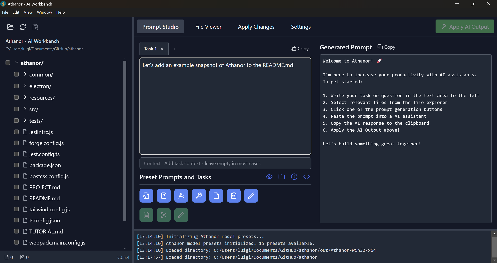

# ⚗️  — AI Workbench <sub><sub></sub></sub>

> _where modern alchemists cook_

[](https://github.com/lacerbi/athanor)
[](https://github.com/lacerbi/athanor)
[](https://github.com/lacerbi/athanor)
[](https://github.com/sponsors/lacerbi)
[](https://nodejs.org/)
[](https://opensource.org/licenses/Apache-2.0)

Athanor is a desktop app for AI-assisted workflows, from coding to technical writing. **Athanor does not require API keys.**

Open a project folder, select files, specify your task, and quickly create effective prompts with all the relevant context to paste into any LLM chat interface like ChatGPT, Claude, or Gemini.
Athanor then assists in efficiently integrating the AI-generated responses back into your project or codebase, ensuring **you remain in full control of all changes while minimizing tedious copy-paste**.

<p align="center">
  
  <br>
  <em>Athanor's interface: File explorer (left), task management and prompt generation (right).</em>
</p>
<p align="center">
  
  <br>
  <em>'Apply Changes' panel: Review and accept/reject diffs generated using any AI chat assistant.</em>
</p>

> 🚧 **WORK IN PROGRESS & ALPHA STAGE**: 🚧 Expect the glassware to be unpolished, reagents to be unstable, and formulas to occasionally yield unexpected outcomes. Features may evolve, and your feedback during this critical phase is invaluable for shaping Athanor's development. Please see our [Development and Feedback](#-development-and-feedback) section below for how to contribute.

## 📋 Table of Contents

- [Key Features](#-key-features)
- [Official Resources](#-official-resources)
- [Installation Setup](#-installation-setup)
- [Quick Start](#-quick-start)
- [Development and Feedback](#-development-and-feedback)
- [License](#-license)

## ✨ Key Features

- **Smart Context Selection**: Easily choose files & folders for your AI prompt, or let the "Autoselect" feature intelligently pick relevant context directly from your local project or codebase.
- **Seamless AI Chat Integration**: Works effortlessly with your favorite AI assistants (like ChatGPT, Claude, Gemini). Just copy from Athanor to your AI, and paste the response back – no API keys needed for the core workflow!
- **Workflow-Tailored Prompts**: Jumpstart your coding tasks with specialized prompt templates designed for a natural development flow: "Autoselect" relevant files, "Query" your project, "Architect" new features, "Code" implementations or "Write" text.
- **Controlled Changes**: Paste AI responses into Athanor. Preview all proposed file changes (creations, updates, deletions) in a clear visual diff viewer, then accept or reject each one individually before any edit is written to disk.
- **Custom Templates**: Create your own prompt and task templates via global and project-specific configuration to tailor Athanor to your workflow.
- **Optional Direct API Automation**: For advanced users or specific automated tasks (like "Autoselect"), Athanor allows direct connection to LLMs via API keys.

## 🔗 Official Resources

- **Main Website:** [athanor.works](https://athanor.works/)
- **Full Tutorial:** [docs.athanor.works/tutorial/introduction](https://athanor.works/docs/tutorial/introduction)
- **Development Blog:** [athanor.works/blog](https://athanor.works/blog)

## 🚀 Installation Setup

**Prerequisites:** Running Athanor will require **Node.js** (latest LTS version, v18.x+).

<details>
<summary><strong>Installing Node.js</strong></summary>

- **Windows**: Download and install from [nodejs.org](https://nodejs.org/)
- **macOS**: Using Homebrew: `brew install node`
- **Linux**:
  - Ubuntu/Debian: `sudo apt update && sudo apt install nodejs npm`
  - Fedora: `sudo dnf install nodejs npm`
  - Or use [NVM](https://github.com/nvm-sh/nvm) (recommended): `nvm install --lts`
  </details>

### Installing Athanor

The easiest way to get started is with the command-line installer:

```bash
npx setup-athanor
```

This will clone the Athanor repository into an `athanor` subfolder and install all dependencies.

<details>
<summary><strong>Manual Installation Instructions</strong></summary>

If the `npx setup-athanor` command doesn't work, or if you prefer to set up the project manually, follow these steps:

1.  **Clone the Repository:**

    ```bash
    git clone https://github.com/lacerbi/athanor.git
    ```

    Alternatively, you can [download the source code](https://github.com/lacerbi/athanor/archive/refs/heads/main.zip) as a ZIP file and extract it.

2.  **Install Dependencies:**
    Navigate into the Athanor folder and install the required npm packages:

    ```bash
    cd athanor
    npm install
    ```

    </details>

### Running Athanor

First, navigate into the Athanor folder, e.g., `cd athanor`.

- **Run in Development Mode (Slower):**
  You can run the app directly from the source code:

  ```bash
  npm start
  ```

- **Compile the Application (Recommended):**
  It is recommended to compile Athanor into a standalone application:

  ```bash
  npm run package
  ```

  This will create a folder named something like `out/Athanor-win32-x64` (the exact name depends on your operating system and architecture). Inside this folder, you will find the executable to run the application. You need to run this only whenever you update to a new version of Athanor.

  <details>
  <summary><strong>Important: Running the Compiled App for the First Time</strong></summary>

  - **On Windows and Linux:**
    Navigate into the output folder (e.g., `out/Athanor-win32-x64`) and run the `Athanor` executable. Since the app was compiled on your machine, you should have no warnings.

  - **On macOS:**
    The output folder (e.g., `out/Athanor-darwin-arm64`) will contain `Athanor.app`. Because this application is not signed with an Apple Developer ID, Gatekeeper will block it by default. To run it:

    1.  Right-click the `Athanor.app` icon and select "Open".
    2.  A dialog will appear warning you that the developer is unidentified. Click the "Open" button to run the app.

    You only need to do this the very first time you launch the application. You can also drag `Athanor.app` to your `/Applications` folder for easier access.
    </details>

## 💡 Quick Start

1. When Athanor launches, you'll be prompted to select a project folder
2. The application will scan your project files and display them in the file explorer
3. Describe the desired task in the Task Description area (e.g., "implement a new function to sort users by registration date")
4. Select relevant files or folders for your task from the file manager
5. Use the prompt templates to generate prompts for your AI assistant, including:

   - **Autoselect**: Ask an LLM to select the best files for your task
   - **Query**: Ask questions about your existing codebase
   - **Coder**: Directly implement the desired feature
   - **Architect**: Plan a complex feature over possibly multiple steps

6. Copy the generated prompt into your AI assistant interface (e.g., Claude, Gemini, ChatGPT)

   - We recommend strong models, such as Claude 4 Sonnet or Gemini 2.5 Pro, but others might work

7. Copy the AI generated response and click on **Apply AI Output** in Athanor

   - Preview proposed changes in the diff viewer and apply them to your project

<details>
  <summary><strong>View Example Workflows (Click to expand)</strong></summary>

### Example Workflows

- **Simple Feature**: Add a dark mode toggle to the application.

  1.  Task Description: `"Implement a dark mode toggle switch in the settings panel that saves the user's preference."`
  2.  Select files manually (e.g., `SettingsPanel.tsx`, `themeStore.ts`) or use the **Autoselect** prompt, then **Apply AI Output**.
  3.  Use the **Coder** prompt, then **Apply AI Output**.
  4.  Review and apply changes in the diff viewer.

- **Complex Feature**: Integrate a new payment gateway (e.g., Stripe) for subscriptions.

  1.  Task Description: `"Integrate Stripe for handling monthly user subscriptions. This should include creating subscription plans, handling webhooks for payment success/failure, and updating user subscription status."`
  2.  Use the **Autoselect** prompt to identify relevant files, then **Apply AI Output**.
  3.  Use the **Architect** prompt to break down the integration into manageable steps, denoted as Commits (e.g., Commit 1: Setup Stripe SDK and API keys; Commit 2: Implement plan selection UI; Commit 3: Handle checkout session creation; Commit 4: Implement webhook endpoint). Then **Apply AI Output**.
  4.  Select Commit 1 from the "Context" area just below the Task description and use the **Coder** prompt.
  5.  After each **Coder** response, **Apply AI Output**, review the changes for that step in the diff viewer, and accept/reject.
  6.  If needed, discuss with your AI assistant to fix issues and apply further changes.
  7.  Once the commit is completed, proceed to the next step from the Architect's plan either in the same chat (e.g., "Proceed with Commit 2"), or generating a new **Coder** prompt with "Commit 2" as context.

- **Query Project**: Understand how user authentication is currently handled.
  1.  Task Description: `"Explain the current user authentication flow, including token generation, storage, and validation. Which files are primarily involved?"`
  2.  Use the **Autoselect** prompt to identify potentially relevant auth-related files, then **Apply AI Output**.
  3.  Use the **Query** prompt to ask your question, then review the AI's explanation.
  4.  Continue the discussion in the AI chat if you have follow-up questions based on the AI's response.

</details>

Read the [**full online tutorial**](https://athanor.works/docs/tutorial/introduction) or the [local version](https://www.google.com/search?q=TUTORIAL.MD) for more detailed information.

## 👥 Development and Feedback

Athanor is being developed by [Luigi Acerbi](https://lacerbi.github.io/).

This project is in its alpha stage, and your feedback is crucial to help us improve and shape Athanor's development. We are primarily focused on understanding how Athanor fits into real-world development workflows.

- **User Experience Feedback:** Share your workflow experiences, what works well, what doesn't, and how Athanor fits into your development process. This is the most valuable contribution at this stage.
- **General Questions, Ideas & Discussions:** Join the conversation on [GitHub Discussions](https://github.com/lacerbi/athanor/discussions).
- **Bug Reports & Specific Feature Requests:** Please submit them via [GitHub Issues](https://github.com/lacerbi/athanor/issues). _(Consider using our issue templates for bugs and features.)_
- **Contributing:** For those interested in contributing, our [CONTRIBUTING.md](CONTRIBUTING.md) file provides detailed information. While we accept code contributions that align with discussed issues, our current focus is on gathering user feedback. All contributions are licensed under the Apache License 2.0 and require agreement to the Developer Certificate of Origin (DCO) by signing off on commits.

## 📜 License

Athanor is released under the [Apache-2.0 license](LICENSE).
